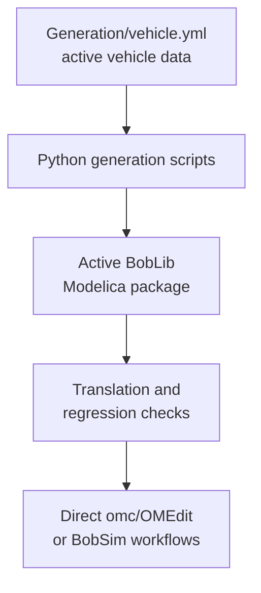

# BobDyn/BobLib

BobDyn/BobLib is the low-level Modelica vehicle model layer for BobDyn. It
contains multibody vehicle models, suspension assemblies, tire records,
generated vehicle definitions, utilities, regression fixtures, and standard
Modelica entry points that BobDyn/BobSim runs.

Use BobDyn/BobLib when you want to inspect, modify, regenerate, or debug the
physical models directly.

Use [BobDyn/BobSim](/bobsim/) when you want full analysis workflows: case
execution, signal extraction, metrics, plots, reports, envelope maps,
sensitivity studies, and public baseline artifacts.

::: tip Which layer should I use?
Clone BobLib directly for model development, package inspection, OMEdit diagram
work, and regression testing. Start with BobSim when you want to run complete
vehicle studies.
:::

> Note: BobLib is a project-specific Modelica vehicle library, not yet a
> general-purpose Modelica vehicle standard library. The current interfaces are
> designed around BobSim consumption.

## Highlights

- Modular vehicle architecture for chassis, suspension, powertrain, electronics, and aero models
- Record-based parameterization that keeps model structure separate from vehicle data
- Generated active vehicle records and wrapper models from `Generation/vehicle.yml`
- Standard models for maneuver simulation and four-post/K&C-style evaluation
- MF5.2 tire records with pure/combined slip data and PAC2002-style relaxation records
- Generated vehicles wired to transient tire slip by default
- Diagram-view animation flags propagated through `inner enableAnimation`
- Root make targets for Python tests, Modelica translation, initialization, and signal regression
- `BobLib.Tests` fixtures for low-level subsystem and full-vehicle regression coverage

## Operating Model

BobLib work usually happens in four phases:

1. Generation
2. Translation
3. Initialization/regression checks
4. Simulation

Generation is the optional Python/YAML step. It reads `Generation/vehicle.yml`
and writes the active Modelica source files: the vehicle record, generated
vehicle wrapper, active axle models, and standard simulation entry points.

Translation is the Modelica compiler step. OpenModelica reads the declarative
Modelica equations, resolves packages, flattens component hierarchies, performs
symbolic transformations and index reduction, then builds executable simulation
code.

Initialization and regression checks are the public guardrails. The test
harness translates the standards and fixtures, initializes every test fixture
against a baseline, and simulates selected signal-level regression models.

Simulation is the runtime step. BobSim normally owns full workflow execution,
but BobLib can also be run directly through `omc` or OMEdit.

<div class="workflow-diagram">



</div>

## Release Checks

From the BobLib repository root:

```bash
make ci
```

That target runs:

- `make lint`
- `make test-python`
- `make modelica-translation`
- `make modelica-initialization`
- `make modelica-regression`

The Modelica checks explicitly load Modelica `3.2.3`, translate the public
standards and `BobLib.Tests` fixtures, initialize fixtures against
`Tests/modelica_initialization_baseline.csv`, and simulate signal-level
regression cases.

## Documentation Map

| Page | Use it for |
| :-- | :-- |
| [Setup](/boblib/setup) | Clone path, prerequisites, Python environment, OpenModelica expectations |
| [CLI Workflow](/boblib/cli-workflow) | `omc` loading, make targets, generation, direct simulation |
| [OMEdit Workflow](/boblib/omedit-workflow) | Opening BobLib visually, diagram browsing, manual simulation |
| [Package Map](/boblib/package-map) | Repository layout and Modelica package areas |
| [Generation](/boblib/generation) | Active `vehicle.yml`, generated outputs, BobSim handoff |
| [Entry Points](/boblib/entry-points) | `VehicleSim`, `FourPostSim`, maneuver modes, tire relaxation behavior |
| [Development](/boblib/development) | Regression tests, checks before commit, screenshot guidance |
| [Troubleshooting](/boblib/troubleshooting) | Common OpenModelica, OMEdit, generation, and regression problems |

## Maturity Notes

- The chassis, suspension, tire, and standard-simulation areas are the most
  mature parts of the tree.
- BobLib is generated in one active vehicle shape at a time rather than carrying
  every possible generated variant.
- Public release confidence comes from the root CI harness plus BobSim's
  workflow-level checks.
