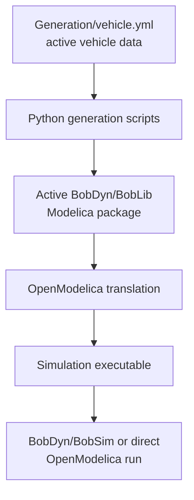

# BobDyn/BobLib

BobDyn/BobLib is the low-level Modelica vehicle model layer for BobDyn. It contains the
multibody vehicle models, suspension assemblies, tire records, generated vehicle
definitions, utilities, and standard Modelica entry points that BobDyn/BobSim runs.

Use BobDyn/BobLib when you want to inspect, modify, regenerate, or debug the physical
models directly.

Use [BobDyn/BobSim](/bobsim/) when you want full simulation workflows: case execution,
signal extraction, metrics, plots, reports, sensitivity runs, DOE outputs, and
dynamic-systems analysis.

::: tip Which layer should I use?
BobDyn/BobLib is generally the low-level model development and debugging layer. If you
really want to work with the models, clone BobDyn/BobLib directly and continue here.

If you want meaningful full-vehicle simulation workflows that wrap these models,
start with the [BobDyn/BobSim documentation](/bobsim/) instead.
:::

> Note: this repository should not be treated as a general-purpose Modelica
> vehicle standard library until it implements
> [VehicleInterfaces](https://github.com/modelica/VehicleInterfaces/) and a
> newer [Modelica Standard Library](https://github.com/modelica/ModelicaStandardLibrary)
> target. The current interfaces are a one-off layer targeted at BobDyn/BobSim
> consumption.

## Highlights

- Modular vehicle architecture for chassis, suspension, powertrain, electronics,
  and aero models
- Record-based parameterization that keeps model structure separate from vehicle
  data
- Standard simulation models for vehicle maneuvers and four-post/K&C-style
  evaluations
- MF5.2-style tire record support backed by local `.tir` templates
- Python generation scripts for deriving active Modelica records and generated
  wrapper models from `Generation/vehicle.yml`
- Utility packages for vector math, tensor helpers, inertia translation,
  multibody actuators, fixtures, and ground-contact support

## Operating Model

BobDyn/BobLib work usually happens in three phases:

1. Generation
2. Translation
3. Simulation

Generation is the optional Python/YAML step. It reads `Generation/vehicle.yml`
and writes the active Modelica source files: the vehicle record, generated
vehicle wrapper, active axle models, and standard simulation entry points.

Translation is the Modelica compiler step. OpenModelica reads the declarative
Modelica equations, resolves packages, flattens component hierarchies, performs
symbolic transformations and index reduction, then builds executable simulation
code.

Simulation is the runtime step. The translated model is executed with parameter
values, solver settings, stop time, and output variable selections. BobDyn/BobSim or
another post-processing layer consumes the resulting files.

The checked-in package can be translated and simulated as-is once OpenModelica
and `Modelica 3.2.3+maint.om` are installed. For conciseness, BobDyn/BobLib keeps only
one generated vehicle architecture active in the Modelica package at a time.
Other architectures live as YAML/templates and are loaded by regenerating the
active package.

## Documentation Map

| Page | Use it for |
| :-- | :-- |
| [Setup](/boblib/setup) | Clone path, prerequisites, Python environment, OpenModelica install expectations |
| [CLI Workflow](/boblib/cli-workflow) | `omc` loading, translation, simulation, generation, scratch builds |
| [OMEdit Workflow](/boblib/omedit-workflow) | Opening BobDyn/BobLib visually, diagram browsing, manual simulation, screenshots |
| [Package Map](/boblib/package-map) | Repository layout and Modelica package areas |
| [Generation](/boblib/generation) | Active `vehicle.yml`, generated outputs, topology keys, BobDyn/BobSim sync |
| [Entry Points](/boblib/entry-points) | `VehicleSim`, `FourPostSim`, maneuver modes, common outputs |
| [Development](/boblib/development) | Generator tests, checks before commit, screenshots, notes, contributing, license |
| [Troubleshooting](/boblib/troubleshooting) | Common OpenModelica, OMEdit, generation, and translation problems |

## Maturity Notes

- The library is still evolving, so some subsystems are more complete than
  others.
- The chassis, suspension, tire, and standard-simulation areas are the most
  mature parts of the tree.
- BobDyn/BobLib is generated in an "active vehicle" shape rather than carrying every
  possible generated variant at once.
