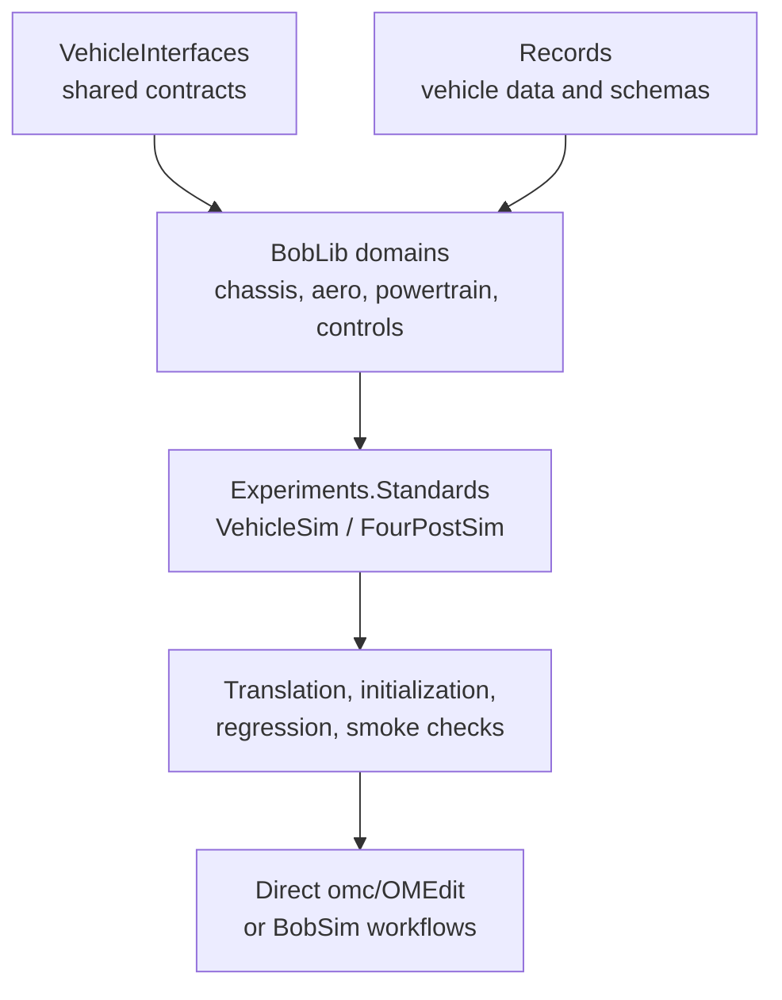

# BobDyn/BobLib

BobDyn/BobLib is the low-level Modelica vehicle model layer for BobDyn. The
active package is `BobLib`: a standalone VehicleInterfaces-aligned library
that retains BobLib's detailed chassis, suspension, tire, aero, powertrain, and
control physics.

::: info Current package name
Current examples use `BobLib.*` class names. Modelica regression and component
fixtures live in the sibling `Tests/BobLibTest` package.
:::

Use BobDyn/BobLib when you want to inspect, modify, translate, simulate, or
debug the physical Modelica models directly.

Use [BobDyn/BobSim](/bobsim/) when you want complete analysis workflows: case
execution, signal extraction, metrics, plots, reports, envelope maps,
sensitivity studies, and public baseline artifacts.

::: tip Which layer should I use?
Clone BobLib directly for model development, package inspection, OMEdit diagram
work, and regression testing. Start with BobSim when you want to run complete
vehicle studies.
:::

## Highlights

- Built against Modelica Standard Library `4.1.0` and VehicleInterfaces `2.0.2`
- Public subsystem packages follow the VehicleInterfaces chassis, driveline,
  powertrain, driver, road, atmosphere, and bus contracts
- `controlBus` is the shared VehicleInterfaces signal namespace for
  standardized cross-subsystem intent, telemetry, status, and limits
- BobLib physics live inside those contracts rather than beside duplicate
  connector systems
- Vehicle-level powertrain layout is explicit: battery, VCU, inverter, motor,
  and driveline are visible at the simulation assembly level
- Aero has a BobLib interface and rigid mount; ride heights arrive through
  `controlBus.chassisBus`, while density and wind arrive through BobLib's
  `AtmosphereBus`
- Records are the durable Modelica parameter schemas and vehicle data
- Python/YAML vehicle generation has been removed from the active model path
- `Experiments.Standards.VehicleSim` and `Experiments.Standards.FourPostSim`
  are the front-facing simulation entry points
- `headless=false` by default so OMEdit examples open with animation visible
- Root tests cover BobLib standards plus the `Tests/BobLibTest` regression and
  component fixtures

## Operating Model

BobLib work now happens in four phases:

1. Select or edit Modelica records and architecture templates.
2. Translate the Modelica entry points.
3. Run initialization, regression, and smoke checks.
4. Simulate directly or through BobSim workflows.

Vehicle selection is plain Modelica. The standard entry points extend checked-in
templates under:

```text
BobLib.Experiments.Standards.Templates.Vehicle
BobLib.Experiments.Standards.Templates.FourPost
```

Those templates expose the complete record and subsystem redeclare set so users
can either follow the template pattern or hard-code a project/year-specific
entry point.

<div class="workflow-diagram">



</div>

## Release Checks

From the BobLib repository root:

```bash
make test PYTHON=.venv/bin/python
```

That target runs Python checks, OpenModelica translation checks, initialization
baselines, signal-level regressions, and BobLib smoke checks. The Modelica
checks load Modelica `4.1.0` and VehicleInterfaces `2.0.2`.

## Documentation Map

| Page | Use it for |
| :-- | :-- |
| [Setup](/boblib/setup) | Clone path, prerequisites, Python environment, OpenModelica expectations |
| [CLI Workflow](/boblib/cli-workflow) | `omc` loading, make targets, direct simulation |
| [OMEdit Workflow](/boblib/omedit-workflow) | Opening BobLib visually, diagram browsing, manual simulation |
| [Package Map](/boblib/package-map) | Repository layout and Modelica package areas |
| [Control Bus](/boblib/control-bus) | VehicleInterfaces bus wiring, telemetry ownership, and explicit connector boundaries |
| [Static Templates](/boblib/generation) | Checked-in records, subsystem redeclares, and architecture templates |
| [Entry Points](/boblib/entry-points) | `VehicleSim`, `FourPostSim`, maneuver modes, tire relaxation behavior |
| [Development](/boblib/development) | Regression tests, architecture rules, checks before commit |
| [Troubleshooting](/boblib/troubleshooting) | Common OpenModelica, OMEdit, dependency, and regression problems |

## Maturity Notes

- `BobLib` is the current standalone package root.
- Public subsystem models should enter through the VehicleInterfaces-style
  top-level domains. Reusable physics can live deeper within each domain.
- Public release confidence comes from the root CI harness plus BobSim's
  workflow-level checks.
