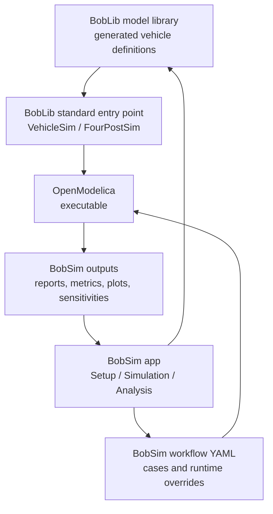

# BobDyn/BobSim

BobDyn/BobSim is the high-fidelity vehicle analysis workspace for BobDyn. It
takes BobDyn/BobLib Modelica vehicle models, builds OpenModelica executables,
runs repeatable studies, extracts signals, computes metrics, renders plots, and
writes public review artifacts.

The normal entry point is the BobSim app. Use the released desktop executable
for day-to-day work, or run the same app from a source checkout when developing.
It configures the active vehicle, writes the generated Modelica definition,
launches StandardSim workflows, and inspects reports, metrics, logs, and saved
result snapshots.

Use BobDyn/BobSim when the question is about vehicle response: how the car
behaves in a standard maneuver, which limit is active, how a parameter change
moves a metric, or whether a design direction deserves deeper model work.

Use [BobDyn/BobLib](/boblib/) when the question is about the low-level model
itself: Modelica package structure, VehicleInterfaces integration, records,
tire models, suspension assemblies, direct OMEdit inspection, or initialization
debugging.

## Operating Model

BobSim keeps the physical model and the analysis workflow separate.

The app path is:

1. Choose or create a vehicle in `Setup`.
2. Save the vehicle.
3. Click `Write to MBD` to generate the Modelica vehicle definition.
4. Open `Simulation`, configure a workflow, then build and run it.
5. Open `Analysis` to download the PDF report, metrics, and per-run signal archive.

The CLI path is the same workflow as commands: build the relevant standard
model, run a standard/envelope/sensitivity workflow from YAML configs, then
inspect the report, metrics CSV, plots, or aggregate table.

Vehicle setup is managed through app vehicle YAML and the generated Modelica
definition, while BobLib remains the physical model library. BobSim workflow
YAML owns case definitions, solver settings, runtime overrides, output
extraction, plotting, and reporting.

<div class="workflow-diagram">



</div>

## Repository Layout

| Path | Role |
| :-- | :-- |
| `makefile` | Public command language for setup, build, run, test, and cleanup |
| `Dockerfile` | OpenModelica and Python environment |
| `docker-compose.yml` | Workflow services used by the make targets |
| `requirements.txt` | Python analysis/reporting dependencies |
| `_0_Utils/` | Shared utilities, plotting, reporting, and the BobLib submodule |
| `_0_Utils/external/BobLib/` | BobDyn/BobLib Modelica library checkout |
| `_1_VisualSim/` | Experimental/offline visualization templates; app preview and OMEdit cover normal visualization |
| `_2_EnvelopeSim/` | Optional GGV and YMD envelope calculations implemented separately from the Modelica standard workflows |
| `_3_StandardSim/` | RampSteerEval, SteadyStateEval, TransientEval, and FourPostEval |
| `_4_OptSim/` | Sensitivity and response-surface workflows |
| `_5_App/` | Local browser app for setup, simulation launch, result review, and saved app libraries |
| `tests/` | Release-polish and workflow regression checks |

## Quick Start

For normal use, download the BobSim desktop asset for your operating system
from the [GitHub Release](https://github.com/BobDyn/BobSim/releases/latest),
extract it, and run `BobSim`.

The desktop app bundles the Python backend and browser frontend. OpenModelica
and generated simulation executables stay local to the user's machine.

For source-checkout development, launch the app with:

```bash
git clone --recurse-submodules https://github.com/BobDyn/BobSim.git
cd BobSim
make init
python -m venv .venv
source .venv/bin/activate
python -m pip install --upgrade pip
python -m pip install -r requirements.txt
make app
```

Then open:

```text
http://127.0.0.1:8765
```

Use the app path first:

```text
Setup -> Save Vehicle -> Write to MBD -> Simulation -> Analysis
```


For Docker-backed CLI workflows:

```bash
make docker-build
make help
```

Run the high-fidelity baseline:

```bash
make standard-eval-all
```

That target builds missing Modelica executables, then runs RampSteerEval,
SteadyStateEval, TransientEval, and FourPostEval against the active BobLib
model definitions and BobSim workflow configs.

## Target Language

BobSim's make targets are intentionally compact and prefix-driven:

| Area | Primary commands | Purpose |
| :-- | :-- | :-- |
| App | `make app` | Launch the source-checkout browser workbench |
| Deploy | `make deploy`, `make deploy-release` | Build the native BobSim desktop artifact for the current OS |
| Docker | `make docker-build`, `make docker-rebuild` | Build the reproducible OpenModelica/Python environment |
| Shells | `make shell`, `make shell-standard`, `make shell-envelope`, `make shell-opt` | Open interactive workflow contexts |
| StandardSim | `make standard-build`, `make standard-eval-all` | Build and run high-fidelity Modelica evaluations |
| EnvelopeSim | `make envelope-ggv`, `make envelope-ymd`, `make envelope-all` | Generate reduced GGV and YMD envelope outputs |
| OptSim | `make opt-standard`, `make opt-envelope`, `make opt-refined` | Run sensitivities and response-surface workflows |
| Quality | `make lint`, `make typecheck`, `make test`, `make ci` | Run release checks |
| Cleanup | `make clean-standard`, `make clean-envelope`, `make clean-opt`, `make clean-all` | Remove build and result artifacts |

Run `make help` for the exact target list in the current checkout.

## Documentation Map

| Page | Use it for |
| :-- | :-- |
| [App](/bobsim/app) | Setup, Simulation, Analysis, saved vehicles, saved configs, and review packages |
| [Configuration](/bobsim/configuration) | Workflow YAML, runtime flags, report and plot config |
| [StandardSim](/bobsim/standard-sim) | RampSteerEval, SteadyStateEval, TransientEval, FourPostEval, runners, reports |
| [Analysis](/bobsim/results) | Review packages, metrics CSVs, raw case artifacts, preservation |
| [EnvelopeSim](/bobsim/envelope) | Optional GGV and YMD envelope calculations |
| [OptSim](/bobsim/doe) | Standard sensitivities, envelope sensitivities, refined response surfaces |
| [Development](/bobsim/development) | Docker, local Python, make targets, quality checks, troubleshooting |

In-progress tooling:

| Page | Use it for |
| :-- | :-- |
| [VisualSim](/bobsim/visualization) | Inactive/offline visualization tooling; app preview and OMEdit cover the normal visual paths |

## What To Run First

For a first user workflow, launch the downloaded `BobSim` executable or run
`make app` from a source checkout.

Then run through:

```text
Setup -> Save Vehicle -> Write to MBD -> Simulation -> Analysis
```


For a scripted release baseline:

```bash
make standard-eval-all
make ci
```

Expected standard outputs:

```text
_3_StandardSim/generated_results/ramp_steer_eval_report.pdf
_3_StandardSim/generated_results/ramp_steer_eval_report_metrics.csv
_3_StandardSim/generated_results/steady_state_eval_report.pdf
_3_StandardSim/generated_results/steady_state_eval_report_metrics.csv
_3_StandardSim/generated_results/transient_eval_report.pdf
_3_StandardSim/generated_results/transient_eval_report_metrics.csv
_3_StandardSim/generated_results/four_post_eval_report.pdf
_3_StandardSim/generated_results/four_post_eval_report_metrics.csv

_3_StandardSim/results/steady_state_eval_report.pdf
_3_StandardSim/results/steady_state_eval_report_metrics.csv
_3_StandardSim/results/transient_eval_report.pdf
_3_StandardSim/results/transient_eval_report_metrics.csv
_3_StandardSim/results/four_post_eval_report.pdf
_3_StandardSim/results/four_post_eval_report_metrics.csv
```

Optional envelope outputs:

```text
_2_EnvelopeSim/results/ggv_report.pdf
_2_EnvelopeSim/results/ggv_report_metrics.csv
_2_EnvelopeSim/results/ymd_report.pdf
_2_EnvelopeSim/results/ymd_report_metrics.csv
```

## Public Release Posture

BobSim is built to make results traceable:

- Vehicle inputs are saved as app vehicle configs and generated Modelica definitions.
- App vehicle/config snapshots are stored alongside saved result bundles.
- Workflow cases and runtime settings are plain YAML.
- Simulation overrides are written as text files.
- Metrics are exported as CSV.
- Reports come from the same configs that ran the studies.
- Sensitivity variants are materialized as per-variant Modelica records and result tables.
- The command language is small enough to remember.

The aim is that a public report metric can be traced back to the workflow
config, extracted signals, compiled Modelica executable, and active vehicle
record.

EnvelopeSim should be read in that same spirit: it is a separate, transparent
implementation of common vehicle envelope calculations such as GGV and YMD
maps. These calculations appear in many vehicle dynamics toolchains. BobSim's
implementation is intended to be sane and usable when desired, not the gold
standard or the canonical reference for envelope theory.
