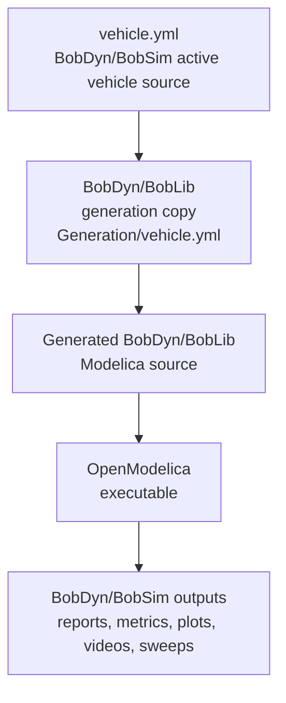

# BobDyn/BobSim

BobDyn/BobSim is the workflow layer for BobDyn. It takes BobDyn/BobLib vehicle models, builds
OpenModelica executables, runs repeatable studies, extracts signals, computes
metrics, renders plots, writes reports, and supports design exploration.

Use BobDyn/BobSim when the question is about vehicle response: what the car does in a
standard maneuver, how a change moves a metric, which envelope limit is active,
or whether a design direction is worth deeper model work.

Use [BobDyn/BobLib](/boblib/) when the question is about the low-level model itself:
Modelica package structure, suspension assemblies, generated vehicle records,
tire templates, direct OMEdit inspection, or model initialization debugging.

## Operating Model

BobDyn/BobSim deliberately keeps the physical model and the analysis workflow separate.
The model stays inspectable in BobDyn/BobLib; the simulation workflow stays scriptable
in Python.

The normal path is:

1. Choose or edit the active vehicle definition.
2. Sync that vehicle definition into BobDyn/BobLib's generation workspace.
3. Generate/build the required Modelica executable.
4. Run a standard study, envelope analysis, visualization, or DOE sweep.
5. Inspect the PDF, CSV, plot, video, or aggregated result table.

The key handoff is the active vehicle YAML:

<div class="workflow-diagram">



</div>

## Repository Layout

| Path | Role |
| :-- | :-- |
| `vehicle.yml` | Active vehicle source for BobDyn/BobSim workflows |
| `makefile` | Setup, build, run, and cleanup targets |
| `Dockerfile` | OpenModelica and Python environment |
| `docker-compose.yml` | `bobsim` and `doe` services |
| `requirements.txt` | Python analysis/reporting dependencies |
| `_0_Utils/` | Plotting, reporting, utility code, and vendored dependencies |
| `_0_Utils/external/BobLib/` | BobDyn/BobLib submodule checkout |
| `_1_VisualSim/` | PyVista visualization templates and MP4 rendering |
| `_2_EnvelopeSim/` | GGV, YMD, and vehicle-review tools |
| `_3_StandardSim/` | Standard maneuver and K&C-style workflows |
| `_4_OptSim/` | Architecture-driven DOE / exploration pipeline |

BobDyn/BobLib lives inside BobDyn/BobSim as a git submodule:

```text
_0_Utils/external/BobLib/
```

For full simulation workflows, clone BobDyn/BobSim and let the submodule provide
BobDyn/BobLib. Clone BobDyn/BobLib directly only when you intentionally want to work at the
model-debugging layer.

## Quick Start

From a fresh checkout:

```bash
git clone --recurse-submodules https://github.com/BobDyn/BobSim.git
cd BobSim
make setup
make shell-bobsim
```

Inside the BobDyn/BobSim shell, build and run the core standard workflows:

```bash
make build-vehicle-sim
make steady-state-eval
make transient-eval
```

Build and run the four-post/K&C-style workflow:

```bash
make build-four-post-sim
make four-post-eval
```

If the repository was cloned without submodules, initialize them with:

```bash
make init
```

## Workflow Map

| Area | Primary commands | Purpose |
| :-- | :-- | :-- |
| StandardSim | `make build-vehicle-sim`, `make steady-state-eval`, `make transient-eval` | Full Modelica maneuver simulations and reports |
| FourPostEval | `make build-four-post-sim`, `make four-post-eval` | Suspension/chassis K&C-style sweeps and metrics |
| VisualSim | `python _1_VisualSim/run_visual.py ... --mp4 ...` | Render geometry animations from visual signal arrays |
| EnvelopeSim | `make ggv-envelope`, `make ymd-envelope`, `make vehicle-review` | Reduced first-principles envelope maps and review reports |
| OptSim | `make sim-doe`, `make sim-standard-sensitivities`, `make sim-envelope-sensitivities` | Architecture-driven DOE, one-factor sensitivities, aggregation, and tornado-ready outputs |
| BobDyn/BobLib generation | `make sync-vehicle-yaml`, `make build-records`, `make build-axle-models` | Update generated Modelica sources from vehicle YAML |

## Documentation Map

Start here, then jump to the page that matches the work:

| Page | Use it for |
| :-- | :-- |
| [Configuration](/bobsim/configuration) | YAML structure, active vehicle sync, Modelica build knobs, plot/report config |
| [StandardSim](/bobsim/standard-sim) | SteadyStateEval, TransientEval, FourPostEval, shared runners, standard reports |
| [Results](/bobsim/results) | Output paths, metrics CSVs, PDF reports, raw case artifacts, preserving runs |
| [Visualization](/bobsim/visualization) | PyVista animation templates, visual signal files, MP4 rendering |
| [EnvelopeSim](/bobsim/envelope) | GGV, YMD, vehicle review, reduced envelope inputs and outputs |
| [OptSim / DOE](/bobsim/doe) | DOE variables, sensitivity generation, tornado diagrams, compile/run pipeline, aggregated tables |
| [Development](/bobsim/development) | Docker, local Python, make targets, cleanup, quality checks, troubleshooting |

## What To Run First

For setup validation, run the standard maneuver path:

```bash
make build-vehicle-sim
make steady-state-eval
make transient-eval
```

Expected public outputs:

```text
_3_StandardSim/results/steady_state_eval_report.pdf
_3_StandardSim/results/steady_state_eval_report_metrics.csv
_3_StandardSim/results/transient_eval_report.pdf
_3_StandardSim/results/transient_eval_report_metrics.csv
```

Then run FourPostEval if you need suspension/chassis metrics used by downstream
envelope tools:

```bash
make build-four-post-sim
make four-post-eval
```

Expected outputs:

```text
_3_StandardSim/results/four_post_eval_report.pdf
_3_StandardSim/results/four_post_eval_report_metrics.csv
```

## Philosophy

BobDyn/BobSim is not just a button around a black-box model. It is the transparent
analysis layer around an explicit physical vehicle model.

- Vehicle definitions are plain YAML and generated Modelica records.
- Build scripts are checked in and readable.
- Simulation overrides are written as text files.
- Metrics are exported as CSV.
- Reports are generated from the same config used to run the study.
- DOE variants are materialized as per-variant Modelica records and directories.

That traceability is the point. A metric in a report should be traceable back to
the case configuration, the signals extracted from the run, the generated
Modelica executable, and the vehicle definition that produced it.
