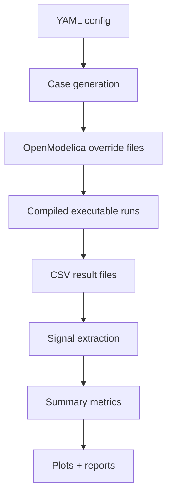

# BobSim

BobSim is the Python orchestration layer for BobDyn. This documentation follows the `../BobSim` checkout, which also contains BobLib as a submodule. BobSim builds simulations, runs cases, extracts signals, computes metrics, and turns results into reports.

## Repository layout

```text
BobSim/
├─ _0_Utils/        plotting and reporting engines
├─ _1_VisualSim/    visualization renderer and templates
├─ _2_EnvelopeSim/  GGV and YMD first-principles envelope tools
├─ _3_StandardSim/  SteadyStateEval, TransientEval, KnC, and shared runners
└─ _4_DOE/          design-of-experiments pipeline scaffold
```

## Active workflows

The primary public workflows are:

|Workflow|Entry point|Purpose|
|:--|:--|:--|
|SteadyStateEval|`_3_StandardSim/SteadyStateEval/steady_state_eval_sim.py`|Steady-state cornering characterization.|
|TransientEval|`_3_StandardSim/TransientEval/transient_eval_sim.py`|Steering transient and frequency-response characterization.|

## What BobSim does

<div style="display: flex; justify-content: center;">



</div>

## Working conventions

- `make init` initializes the BobLib submodule inside `../BobSim`.
- `make setup` builds the containerized toolchain.
- `omc _3_StandardSim/build.mos` compiles the active model.
- `make SteadyStateEval` and `make TransientEval` run the public standard studies.

## Learn more

- [Startup Guide](/startup-guide/)
- [Use Guide](/use-guide/)
- [BobLib](/boblib/)
- [Vehicle performance metrics](/reference/metrics)
- [Control theory](/reference/control-theory)
