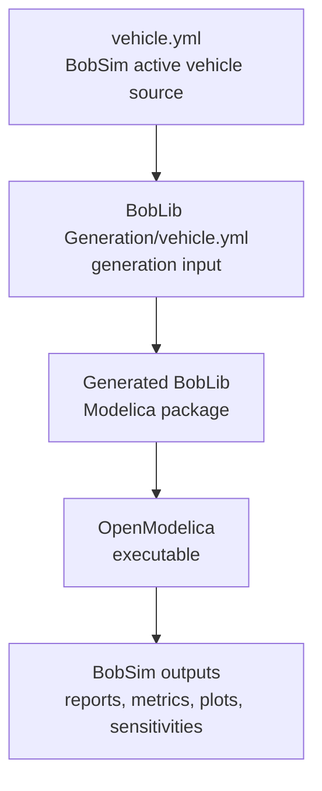

# BobDyn/BobSim

BobDyn/BobSim is the high-fidelity vehicle analysis workspace for BobDyn. It
takes BobDyn/BobLib Modelica vehicle models, builds OpenModelica executables,
runs repeatable studies, extracts signals, computes metrics, renders plots, and
writes public review artifacts.

Use BobDyn/BobSim when the question is about vehicle response: how the car
behaves in a standard maneuver, which limit is active, how a parameter change
moves a metric, or whether a design direction deserves deeper model work.

Use [BobDyn/BobLib](/boblib/) when the question is about the low-level model
itself: Modelica package structure, tire records, suspension assemblies,
generated vehicle definitions, direct OMEdit inspection, or initialization
debugging.

## Operating Model

BobSim keeps the physical model and the analysis workflow separate.

1. Edit the active vehicle definition in `vehicle.yml`.
2. Build the relevant BobLib standard model.
3. Run a standard, envelope, or sensitivity workflow.
4. Inspect the report, metrics CSV, plots, or aggregate table.

The build targets copy `vehicle.yml` into BobLib's generation workspace before
generating and compiling Modelica source.

<div class="workflow-diagram">



</div>

## Repository Layout

| Path | Role |
| :-- | :-- |
| `vehicle.yml` | Active vehicle source for BobSim workflows |
| `makefile` | Public command language for setup, build, run, test, and cleanup |
| `Dockerfile` | OpenModelica and Python environment |
| `docker-compose.yml` | Workflow services used by the make targets |
| `requirements.txt` | Python analysis/reporting dependencies |
| `_0_Utils/` | Shared utilities, plotting, reporting, and the BobLib submodule |
| `_0_Utils/external/BobLib/` | BobDyn/BobLib Modelica library checkout |
| `_1_VisualSim/` | Experimental/offline visualization templates; core visualization currently happens in OMEdit |
| `_2_EnvelopeSim/` | Optional GGV and YMD envelope calculations implemented separately from the Modelica standard workflows |
| `_3_StandardSim/` | SteadyStateEval, TransientEval, and FourPostEval |
| `_4_OptSim/` | Sensitivity and response-surface workflows |
| `tests/` | Release-polish and workflow regression checks |

## Quick Start

```bash
git clone --recurse-submodules https://github.com/BobDyn/BobSim.git
cd BobSim
make init
make docker-build
make help
```

Run the high-fidelity baseline:

```bash
make standard-eval-all
```

That target builds missing Modelica executables, then runs SteadyStateEval,
TransientEval, and FourPostEval against the repo-root `vehicle.yml`.

## Target Language

BobSim's make targets are intentionally compact and prefix-driven:

| Area | Primary commands | Purpose |
| :-- | :-- | :-- |
| Docker | `make docker-build`, `make docker-rebuild` | Build the reproducible OpenModelica/Python environment |
| Shells | `make shell`, `make shell-standard`, `make shell-envelope`, `make shell-opt` | Open interactive workflow contexts |
| StandardSim | `make standard-build`, `make standard-eval-all` | Build and run high-fidelity Modelica evaluations |
| EnvelopeSim | `make envelope-ggv`, `make envelope-ymd`, `make envelope-all` | Generate reduced GGV and YMD envelope outputs |
| OptSim | `make opt-standard`, `make opt-envelope`, `make opt-refined` | Run sensitivities and response-surface workflows |
| Quality | `make lint`, `make typecheck`, `make test`, `make ci` | Run release checks |
| Cleanup | `make clean-standard`, `make clean-envelope`, `make clean-opt`, `make clean-all` | Remove generated artifacts |

Run `make help` for the exact target list in the current checkout.

## Documentation Map

| Page | Use it for |
| :-- | :-- |
| [Configuration](/bobsim/configuration) | Active vehicle sync, workflow YAML, runtime flags, report and plot config |
| [StandardSim](/bobsim/standard-sim) | SteadyStateEval, TransientEval, FourPostEval, runners, reports |
| [Results](/bobsim/results) | Output paths, metrics CSVs, raw case artifacts, preservation |
| [EnvelopeSim](/bobsim/envelope) | Optional GGV and YMD envelope calculations |
| [OptSim](/bobsim/doe) | Standard sensitivities, envelope sensitivities, refined response surfaces |
| [Development](/bobsim/development) | Docker, local Python, make targets, quality checks, troubleshooting |

In-progress tooling:

| Page | Use it for |
| :-- | :-- |
| [VisualSim](/bobsim/visualization) | Inactive/offline visualization tooling; core visualization currently happens in OMEdit |

## What To Run First

For a release baseline:

```bash
make standard-eval-all
make ci
```

Expected standard outputs:

```text
_3_StandardSim/results/steady_state_eval_report.pdf
_3_StandardSim/results/steady_state_eval_report_metrics.csv
_3_StandardSim/results/transient_eval_report.pdf
_3_StandardSim/results/transient_eval_report_metrics.csv
_3_StandardSim/results/four_post_eval_report.pdf
_3_StandardSim/results/four_post_eval_report_metrics.csv
```

Optional envelope outputs:

```text
_2_EnvelopeSim/results/ggv_report.pdf
_2_EnvelopeSim/results/ggv_report_metrics.csv
_2_EnvelopeSim/results/ymd_report.pdf
_2_EnvelopeSim/results/ymd_report_metrics.csv
```

## Public Release Posture

BobSim is built to make results traceable:

- Vehicle inputs are plain YAML.
- Generated Modelica sources are inspectable.
- Simulation overrides are written as text files.
- Metrics are exported as CSV.
- Reports come from the same configs that ran the studies.
- Sensitivity variants are materialized as per-variant Modelica records and result tables.
- The command language is small enough to remember.

The aim is that a public report metric can be traced back to the workflow
config, the extracted signals, the generated Modelica executable, and the active
vehicle definition.

EnvelopeSim should be read in that same spirit: it is a separate, transparent
implementation of common vehicle envelope calculations such as GGV and YMD
maps. These calculations appear in many vehicle dynamics toolchains. BobSim's
implementation is intended to be sane and usable when desired, not the gold
standard or the canonical reference for envelope theory.
