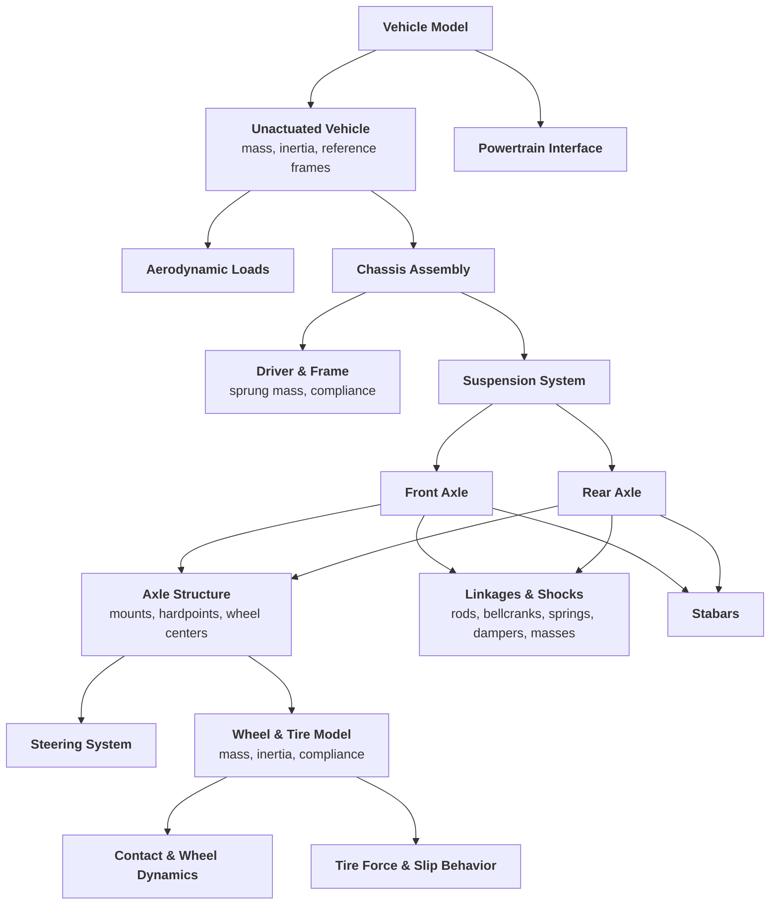

## Vehicle Model Structure

BobDyn models the vehicle as a hierarchy of physical systems. The structure is
kept explicit so geometry, loads, constraints, and response signals can be
traced from full-vehicle behavior down to subsystem assumptions.

This is central to the project philosophy: transparency starts with knowing
where each piece of vehicle behavior lives in the model.

Start with [BobDyn/BobSim](/bobsim/) for complete simulation workflows, case execution,
metrics, plots, and reports. Go to [BobDyn/BobLib](/boblib/) when you want to inspect,
modify, or debug the low-level vehicle models directly.

<div class="model-structure-diagram">



</div>

---

## A physical model for vehicle characterization

Vehicles are dynamic systems, and the driver experiences their response rather than their equations. BobDyn is built around that idea: use meaningful response metrics, keep the model inspectable, and make every study traceable from configuration to report.

BobDyn/BobLib provides the physical vehicle model in Modelica. BobDyn/BobSim takes that model, runs repeatable studies, extracts signals, and turns the results into plots, metrics, and reports.

The result is a workflow for generating simulation ground truth that you can inspect, compare, and reuse across design iterations.

---

## What BobDyn enables

|Capability|Description|
|:--|:--|
|**Standard tests**|Run repeatable studies such as steady-state cornering, transient steering response, and kinematics/compliance workflows.|
|**Automated reporting**|Turn simulation output into metrics, plots, CSV files, and engineering reports without hand-built post-processing.|
|**Model correlation**|Use full-system simulation results as reference data for reduced-order models, design tools, and simplifying assumptions.|
|**Design exploration**|Sweep parameters, compare configurations, and see how physical changes propagate through vehicle-level behavior.|

---

## Sample Outputs

The report links below come from current BobDyn/BobSim StandardSim workflows.
They render on the page for quick inspection, with direct PDF links available
for a wider view.

<div class="sample-output-grid">
  <article class="sample-output-card">
    <p class="sample-output-label">SteadyStateEval Report</p>
    <p>
      Ramp-steer velocity-isoline workflow with controller behavior, response
      traces, fitted handling metrics, and CSV-ready summary values.
    </p>
    <div class="sample-output-links">
      <a href="/steady_state_eval_report.pdf" target="_blank" rel="noreferrer">Open PDF report</a>
    </div>
    <PdfEmbed src="/steady_state_eval_report.pdf" max-height="34rem" />
  </article>
  <article class="sample-output-card">
    <p class="sample-output-label">TransientEval Report</p>
    <p>
      Step-steer and sine-response workflow with gain, phase, lag, rise-time,
      and overshoot metrics from the same generated vehicle model.
    </p>
    <div class="sample-output-links">
      <a href="/transient_eval_report.pdf" target="_blank" rel="noreferrer">Open PDF report</a>
    </div>
    <PdfEmbed src="/transient_eval_report.pdf" max-height="34rem" />
  </article>
</div>

The videos below are visual context only. They are not labeled as the exact
runs shown in the PDF reports.

<div class="sample-output-grid">
  <article class="sample-output-card">
    <p class="sample-output-label">Closed-Loop PI Control Sample</p>
    <video autoplay loop muted playsinline width="100%">
      <source src="/steady_state_eval.mp4" type="video/mp4">
    </video>
    <p>
      A proof-of-concept PI radius-control run. It is not presented as a tuned
      controller or as the exact report case.
    </p>
    <div class="sample-output-links">
      <a href="/steady_state_eval.mp4" target="_blank" rel="noreferrer">Open sample</a>
    </div>
  </article>
  <article class="sample-output-card">
    <p class="sample-output-label">Prescribed Frequency Input Sample</p>
    <video autoplay loop muted playsinline width="100%">
      <source src="/transient_eval.mp4" type="video/mp4">
    </video>
    <p>
      A prescribed steering-frequency input sample. It shows the workflow
      visually without claiming one-to-one correspondence to the report pages.
    </p>
    <div class="sample-output-links">
      <a href="/transient_eval.mp4" target="_blank" rel="noreferrer">Open sample</a>
    </div>
  </article>
</div>

## Minimal Worked Example

The fastest proof path uses the example `vehicle.yml` in BobDyn/BobSim and runs
the complete standard baseline:

```bash
git clone --recurse-submodules https://github.com/BobDyn/BobSim.git
cd BobSim
make init
make docker-build
make standard-eval-all
```

The `standard-eval-all` target builds the required Modelica executables when
they are missing, then runs SteadyStateEval, TransientEval, and FourPostEval.
The expected review artifacts are PDF reports and metrics CSVs under
`_3_StandardSim/results/`.

---

## Transparent by design

BobDyn is built to eliminate black-box behavior through an explicit, inspectable, and reproducible simulation pipeline.

- **Physical models are defined from first principles**  
  Geometry, constraints, and force generation are implemented directly in Modelica.

- **Configuration is human-readable**  
  Vehicle definitions, test setups, and simulation parameters are defined in plain-text YAML and Modelica `.mo` files.

- **Execution is visible and scriptable**  
  Simulation, extraction, analysis, and reporting workflows are implemented in Python and designed to be built upon, modified, or replaced.

- **Results are directly traceable**  
  Outputs can be linked back to the model structure, configuration, and equations that produced them.

All models, solvers, workflows, and reports come from plain-text, version-controlled sources.
