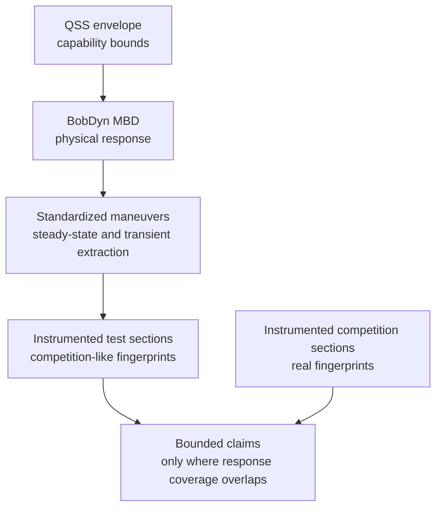

# FSAE Bridge

BobDyn is broader than Formula SAE. It is a high-fidelity vehicle analysis
framework, not an FSAE-only tool.

FSAE still gives one of the most practical explanations for why BobDyn exists.
Teams need to design a vehicle that performs well in a real competition, but
they work with limited time, limited test days, limited instrumentation history,
and only a small number of chances to observe the car in a true competition
environment.

That makes the engineering problem subtle. The team does not only need a fast
car on paper. The team needs to understand capability, response, reliability,
and driver interaction well enough to make design decisions under uncertainty.

BobDyn reduces uncertainty about the vehicle's physical response. It can
support competition-focused design, but it should do that through a careful
chain of evidence rather than a direct leap from simulation to points.

This page speaks to FSAE technical leads, vehicle dynamics groups, test leads,
and simulation users who need to connect design decisions to competition
evidence. It assumes comfort with basic vehicle dynamics and logged data, but it
does not assume a full driver-in-the-loop or professional test infrastructure.

Read this page with [Vehicle Dynamics](/reference/vehicle-dynamics) in mind.
The vehicle dynamics page describes what the physical system is. This page
describes what a competition team can responsibly claim about that system.
The limits are explicit: the [What This Does Not Claim](#what-this-does-not-claim)
section names the claims this framework refuses to make.

## The FSAE Challenge

FSAE performance combines many effects. It does not reduce to a pure vehicle
response metric.

A result depends on:

- vehicle capability
- transient response
- driver execution
- tire state
- reliability
- weather and surface conditions
- event operations
- penalties
- competitor performance
- the scoring system

Lap simulation can still help. It can expose bottlenecks, compare assumptions,
and prioritize design work. The problem does not come from lap simulation
itself. The problem comes from treating a simulated lap time, a test-course lap
time, or a points estimate as if it directly proves competition performance.

The mature question is narrower:

What can the team justifiably claim about the car's physical response, and
where does that claim transfer to competition?

That question has a cost. It requires model discipline, repeatable tests,
calibrated sensors, clean logs, and enough engineering time to compare the same
signals across simulation, testing, and competition. The framework below is not
free process. It is a way to spend limited effort on claims that can survive
contact with real data.

## Lap-Time Simulation As A Statistical Model

A serious lap-time workflow should treat lap time as a statistical model, not a
single deterministic truth value.

The simulation can still contain deterministic physics. A point-mass solver,
QSS envelope, optimal-control lap simulator, or multibody-derived reduced model
can all compute a nominal lap. The decision-facing result should still carry
uncertainty because the inputs and context carry uncertainty.

A useful structure is:

$$
T \sim p(T \mid
x_{\text{vehicle}},
x_{\text{driver}},
x_{\text{track}},
x_{\text{surface}},
x_{\text{event}})
$$

where $T$ is lap time and the conditioning variables describe the vehicle,
driver, track, surface, and event context.

In practical terms, a lap-time simulation should report:

- expected lap time or segment time
- uncertainty bands or percentiles
- sensitivity to tire, aero, mass, power, braking, and driver assumptions
- probability of beating a baseline, not only a nominal delta
- regions where the model has no validation coverage
- residual error against test and competition telemetry

This turns lap simulation into a decision tool instead of a claim machine. The
team can still use a nominal lap time, but it should read that number as one
statistic from a model, not as the model's entire conclusion.

## Reduced Models Must Reflect The System

This is the core idea.

A reduced-order model is not a separate reality. It is a compressed view of the
original physical system.

QSS envelopes, lap-time tools, tire abstractions, score sensitivity studies,
and simple handling models can all help, but each one makes a claim about the
real vehicle. That claim only stays meaningful if the reduced model preserves
the parts of the original system that matter for the question.

For example:

- a QSS envelope must reflect the tire, aero, mass, power, and load-transfer behavior it summarizes
- a lap-time model must reflect the response regimes that actually appear on track
- a statistical lap-time model must reflect uncertainty in inputs, driver behavior, and event context
- a points model must reflect the uncertainty between vehicle performance and scored outcome
- a test-section comparison must reflect the physical states used in competition

If the reduced model no longer represents the original system in the region of
interest, it may still offer convenience, but the team should not treat it as
evidence.

BobDyn keeps that connection visible. The high-fidelity model, controlled
tests, and telemetry fingerprints act as anchors so reduced-order tools can
remain useful without drifting away from the vehicle they claim to represent.

## Evidence Levels

FSAE teams often want simulation, test data, and competition outcomes to
connect in one simple line. In practice, that line needs evidence levels. A
team can adopt the workflow in layers; each layer supports a different strength
of claim.

| Level | Required evidence | What the team can claim |
| :-- | :-- | :-- |
| Simulation only | QSS and MBD with documented assumptions | design trends and predicted response, not competition transfer |
| Controlled test correlation | standardized steady-state and transient tests with measured signals | model agreement in the tested operating region |
| Competition telemetry | competition logs using the same signal set and definitions | local transfer claims where response fingerprints overlap |
| Repeated competition coverage | repeated section data, driver/context notes, and uncertainty estimates | stronger bounded claims with quantified residual uncertainty |

This matters for single-year teams. The minimum viable version does not ask the
team to build a perfect simulation program. It asks the team to:

1. keep a simple QSS envelope current,
2. run the high-fidelity model on the most important design questions,
3. log steering, speed, acceleration, yaw rate, throttle, and brake in testing,
4. repeat a small number of controlled steady-state and transient maneuvers,
5. log the same signals at competition,
6. compare only the sections and regimes the data actually cover.

Everything beyond that improves resolution. It does not change the basic rule:
claim only what the evidence covers.

## Core Workflow

Teams should not ask simulation to directly predict FSAE competition
performance. Simulation should support a chain of evidence.

The workflow:

1. Quasi-steady-state analysis defines the operating envelope.
2. Multibody dynamics evaluates physical response inside that envelope.
3. Standardized steady-state and transient extraction maneuvers validate the response scientifically.
4. Instrumented test and competition data produce response-space fingerprints.
5. The team allows performance claims only where the fingerprints overlap.

This is not a magic points model. It is a way to decide where test and
simulation evidence can support bounded claims about real competition sections.

## QSS Defines Capability

Quasi-steady-state analysis is useful because it defines what the vehicle could
do under simplified equilibrium assumptions.

It can answer questions such as:

- what combined longitudinal and lateral acceleration may be possible
- where tire, aero, power, or braking limits appear
- which speed ranges expose a capability bottleneck
- whether a proposed design direction is worth higher-fidelity analysis

QSS does not describe the whole vehicle. It describes the operating envelope.
It tells you where the car may be able to operate, not how the full dynamic
system will enter, leave, or feel inside those states.

## MBD Explains Response

BobDyn's multibody model evaluates the physical response inside the envelope.

Geometry, compliance, inertia, transient tire behavior, steering, load paths,
damping, aero, and constraints become a time-domain vehicle response here.

That response matters because drivers do not experience an envelope plot. They
experience buildup, delay, overshoot, correction demand, stability, saturation,
and confidence.

BobDyn/BobLib and BobDyn/BobSim keep those response mechanisms visible:

- engineers can inspect the model
- teams can repeat the tests
- signals remain close to the metrics
- reports trace back to configuration and source

## Standardized Maneuvers Validate Response

Scientific validation needs controlled maneuvers before the team makes
competition claims. The standard number itself matters less than the practice:
the team uses repeatable maneuvers that extract steady-state and transient
response in a way engineers can compare across simulation, test, and future
vehicle iterations.

Two checks work well for dynamic-system correlation:

- ISO 4138-style steady-state response extraction
- ISO 7401-style transient steering response extraction

These maneuvers do not prove that a car will win competition. They validate
pieces of the response model in controlled conditions.

That matters. If the model cannot reproduce measured steady-state and transient
response in standardized extraction maneuvers, the team should not trust it to
explain more complex competition sections.

## Fingerprints, Not Scaling

This is the most important distinction:

Do not take a test-section lap time and scale it to a competition lap time.

That is a scaling problem, and it is usually the wrong problem.

Instead, compare physical response-space fingerprints. A test section supports
a claim about a competition section only when the measured vehicle response is
sufficiently similar.

Useful fingerprint signals include:

- lateral acceleration
- yaw rate
- yaw acceleration
- speed
- steering input
- throttle
- brake
- correction behavior

These signals describe what the car and driver actually did, not just how long
the segment took.

A fingerprint is not one number. It describes a section's response state using
time histories, distributions, and extracted features. A practical feature
vector might include:

$$
\phi =
\left[
a_y,\ r,\ \dot{r},\ V,\ \delta,\ \text{throttle},\ \text{brake},
\text{corrections},\ \text{utilization}
\right]
$$

where the exact entries depend on the available sensors and the claim. The team
should define the feature vector before the comparison so the similarity test
does not become a post-hoc justification.

The team can check similarity several ways:

- signal overlays for time-aligned or event-aligned sections
- histograms or density maps of speed, lateral acceleration, yaw rate, and inputs
- response-space occupancy maps such as $(V, a_y)$, $(a_y, r)$, or $(\delta, r)$
- normalized residuals between test and competition traces
- correction behavior such as steering reversals, correction energy, or driver input rate
- uncertainty bands from repeated runs when repeated data exist

"Sufficiently similar" is not universal. The team must define it for the claim.
A claim about lateral capability may care most about speed, lateral
acceleration, and tire utilization. A claim about driver confidence or
transient stability may care more about yaw-rate phase, correction behavior,
and steering effort.

## Coverage Drives Uncertainty

Coverage bridges test data and competition claims.

If a competition-like test section covers the same response regimes as a real
competition section, the test data can support a stronger transfer claim. If a
region is weakly covered or uncovered, uncertainty grows.

The framework should reject strong claims where coverage is weak.

Examples:

| Situation | Claim quality |
| :-- | :-- |
| Test and competition fingerprints overlap tightly | Stronger local transfer claim |
| Similar speed and acceleration, but different correction behavior | Moderate claim with driver-layer uncertainty |
| Similar lap time, different response regimes | Weak claim |
| Competition region has no test coverage | No strong performance claim |

This keeps the stack honest. It does not pretend every test day predicts
competition. It asks where the physics are similar enough for a bounded claim.

Operationally, refusal should leave a visible record. It can look like:

- marking a section as uncovered in the report
- downgrading a result from a transfer claim to an observation
- excluding the section from points or lap-time claims
- adding the missing regime to the next test plan
- reporting the model or test as unvalidated in that region

Refusal does not mean failure. It prevents false confidence.

## Competition Data Matters

This idea depends on complete competition instrumentation.

At minimum, the car should log the same response signals at competition that it
logs during testing:

- accelerations
- yaw rate and yaw acceleration
- speed
- steering
- throttle
- brake
- time alignment and segment markers

Without competition telemetry, the framework can still validate the vehicle and
compare test configurations. It cannot confidently say which test fingerprints
matched the real competition response.

With competition telemetry, even a single year of data becomes much more
valuable. The team can identify which response regimes were actually used at
competition, then focus future testing and simulation on covering those regimes.

The minimum useful competition logger does not need exotic hardware, but it
does need consistency. At a minimum, the team should preserve sensor
calibration, channel names, units, sample rates, filtering choices, and segment
definitions between test and competition. A comparison between incompatible
logs is usually a workflow problem before it is a vehicle dynamics problem.

## What This Does Not Claim

This framework does not claim that:

- simulation directly predicts FSAE points
- a competition-like course can be scaled into a competition lap time
- QSS envelopes are enough to design the car
- driver-in-the-loop is required for core validation
- a single competition year eliminates uncertainty

It claims something narrower and more useful:

When measured response-space fingerprints overlap sufficiently, test data can
support statistically bounded performance claims for similar competition
sections. When coverage is weak, uncertainty increases and the stack rejects
strong claims.

If repeated data or a clear uncertainty model do not exist, the team should
weaken the claim: the evidence can support an engineering comparison, but not a
strong statistical bound.

## Driver Layer

Driver-in-the-loop and subjective-objective correlation sit above the core
validation stack.

They add value because they can:

- train drivers
- reduce run-to-run variance
- expose correction behavior
- connect subjective feedback to measurable response metrics
- translate driver comments into setup levers

The core validation stack does not require them. A team can still build a
serious QSS, MBD, standardized-maneuver, and telemetry-fingerprint workflow
without DIL.

That matters for a single-year timeline. DIL is powerful, but it can also
consume time, infrastructure, and calibration effort. The core stack should
stand on measured vehicle response first.

## Accelerated Single-Year Path

For a team with one season of runway, the practical sequence is:

1. Build a QSS envelope to understand capability and bottlenecks.
2. Use BobDyn MBD to evaluate physical response inside that envelope.
3. Run standardized steady-state and transient extraction maneuvers.
4. Instrument competition-like test sections with complete telemetry.
5. Instrument real competition with the same telemetry package.
6. Compare response-space fingerprints by section.
7. Use overlap to make bounded local claims.
8. Treat uncovered regions as uncertainty, not as evidence.

The goal is not perfect prediction. The goal is faster learning with fewer
unjustified assumptions.

People-hours create the practical constraint. A realistic single-year plan
should avoid building every possible analysis at once. A useful priority order:

1. define the few response claims that matter most,
2. make the logging and units reliable,
3. validate the model against controlled maneuvers,
4. compare a small number of competition-like sections,
5. only then expand the metric library or driver-layer analysis.

## What Winning Means Here

Designing a vehicle to win competition is not the same as optimizing one
simulated lap.

Winning requires:

- capability
- response quality
- driver confidence
- reliability
- repeatability
- scoring awareness
- operational execution

BobDyn primarily helps with the physical capability and response-quality
pieces. It can support design decisions that matter for competition, but it
should stay honest about what the data actually prove.

The mature claim is that BobDyn helps teams connect vehicle physics,
controlled validation, and competition telemetry so they can make better design
decisions under real FSAE constraints.
