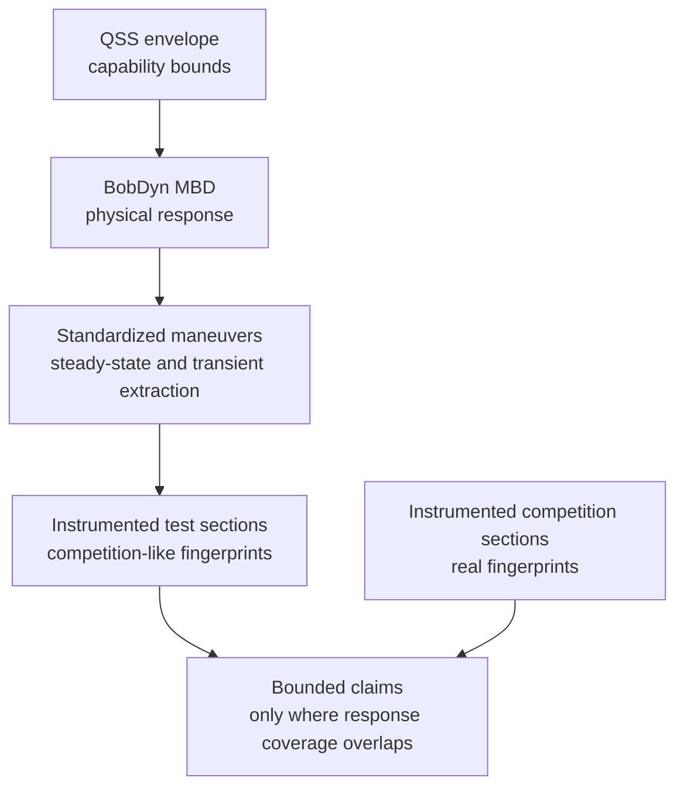

# FSAE Connection

BobDyn is broader than Formula SAE. It is a high-fidelity vehicle analysis
framework, not an FSAE-only tool.

FSAE is still one of the most practical ways to explain why BobDyn exists.
Teams are trying to design a vehicle that performs well in a real competition,
but they have limited time, limited test days, limited instrumentation history,
and only a small number of chances to observe the car in a true competition
environment.

That makes the engineering problem subtle. The team does not only need a fast
car on paper. It needs a car whose capability, response, reliability, and
driver interaction can be understood well enough to make design decisions under
uncertainty.

BobDyn's role is to reduce uncertainty about the vehicle's physical response.
It can support competition-focused design, but it should do that through a
careful chain of evidence rather than a direct leap from simulation to points.

## The FSAE Challenge

FSAE performance is a competition outcome, not a pure vehicle response metric.

A result depends on:

- vehicle capability
- transient response
- driver execution
- tire state
- reliability
- weather and surface conditions
- event operations
- penalties
- competitor performance
- the scoring system

Lap simulation can still be useful. It can expose bottlenecks, compare
assumptions, and help prioritize design work. The problem is not lap simulation
itself. The problem is treating a simulated lap time, a test-course lap time,
or a points estimate as if it directly proves competition performance.

The mature question is narrower:

What can the team justifiably claim about the car's physical response, and
where does that claim transfer to competition?

## Reduced Models Must Reflect The System

This is the core idea.

A reduced-order model is not a separate reality. It is a compressed view of the
original physical system.

QSS envelopes, lap-time tools, tire abstractions, score sensitivity studies,
and simple handling models can all be valuable, but each one is making a claim
about the real vehicle. That claim only stays meaningful if the reduced model
preserves the parts of the original system that matter for the question being
asked.

For example:

- a QSS envelope must reflect the tire, aero, mass, power, and load-transfer behavior it summarizes
- a lap-time model must reflect the response regimes that actually appear on track
- a points model must reflect the uncertainty between vehicle performance and scored outcome
- a test-section comparison must reflect the physical states used in competition

If the reduced model no longer represents the original system in the region of
interest, it may still be convenient, but it should not be treated as evidence.

BobDyn's role is to keep that connection visible. The high-fidelity model,
controlled tests, and telemetry fingerprints act as anchors so reduced-order
tools can be useful without becoming detached from the vehicle they claim to
represent.

## What This Page Adds

FSAE teams often want simulation, test data, and competition outcomes to connect
in one simple line. In practice, that line needs structure.

This page frames the connection as a validation and transfer problem:

- simulation explains physical capability and response
- standardized extraction maneuvers validate response
- telemetry fingerprints decide where test and competition sections are similar
- coverage determines uncertainty
- weak coverage means no strong competition claim

That structure lets BobDyn support competition-focused design without asking
the model to prove more than it can prove.

## Core Workflow

Simulation should not be asked to directly predict FSAE competition
performance. It should support a chain of evidence.

The workflow is:

1. Quasi-steady-state analysis defines the operating envelope.
2. Multibody dynamics evaluates physical response inside that envelope.
3. Standardized steady-state and transient extraction maneuvers validate the response scientifically.
4. Instrumented test and competition data produce response-space fingerprints.
5. Performance claims are allowed only where the fingerprints overlap.

This is not a magic points model. It is a way to decide where test and
simulation evidence can support bounded claims about real competition sections.

## The Stack

## QSS Defines Capability

Quasi-steady-state analysis is useful because it defines what the vehicle could
do under simplified equilibrium assumptions.

It can answer questions such as:

- what combined longitudinal and lateral acceleration may be possible
- where tire, aero, power, or braking limits appear
- which speed ranges expose a capability bottleneck
- whether a proposed design direction is worth higher-fidelity analysis

QSS is not the whole vehicle. It is the operating envelope. It tells you where
the car may be able to operate, not how the full dynamic system will enter,
leave, or feel inside those states.

## MBD Explains Response

BobDyn's multibody model evaluates the physical response inside the envelope.

This is where geometry, compliance, inertia, transient tire behavior, steering,
load paths, damping, aero, and constraints become a time-domain vehicle
response.

That response matters because drivers do not experience an envelope plot. They
experience buildup, delay, overshoot, correction demand, stability, saturation,
and confidence.

BobDyn/BobLib and BobDyn/BobSim are meant to keep those response mechanisms
visible:

- the model is inspectable
- tests are repeatable
- signals remain close to the metrics
- reports are traceable back to configuration and source

## Standardized Maneuvers Validate Response

Scientific validation needs controlled maneuvers before it makes competition
claims. The important idea is not the standard number itself; it is that the
team uses repeatable maneuvers that extract steady-state and transient response
in a way that can be compared across simulation, test, and future vehicle
iterations.

Two recommended checks for dynamic-system correlation are:

- ISO 4138-style steady-state response extraction
- ISO 7401-style transient steering response extraction

These maneuvers do not prove that a car will win competition. They validate
pieces of the response model in controlled conditions.

That matters. If the model cannot reproduce measured steady-state and transient
response in standardized extraction maneuvers, it should not be trusted to
explain more complex competition sections.

## Fingerprints, Not Scaling

This is the most important distinction:

Do not take a test-section lap time and scale it to a competition lap time.

That is a scaling problem, and it is usually the wrong problem.

Instead, compare physical response-space fingerprints. A test section supports
a claim about a competition section only when the measured vehicle response is
sufficiently similar.

Useful fingerprint signals include:

- lateral acceleration
- yaw rate
- yaw acceleration
- speed
- steering input
- throttle
- brake
- correction behavior

These signals describe what the car and driver actually did, not just how long
the segment took.

## Coverage Drives Uncertainty

Coverage is the bridge between test data and competition claims.

If a competition-like test section covers the same response regimes as a real
competition section, the test data can support a stronger transfer claim. If a
region is weakly covered or uncovered, uncertainty grows.

The framework should refuse strong claims where coverage is weak.

Examples:

| Situation | Claim quality |
| :-- | :-- |
| Test and competition fingerprints overlap tightly | Stronger local transfer claim |
| Similar speed and acceleration, but different correction behavior | Moderate claim with driver-layer uncertainty |
| Similar lap time, different response regimes | Weak claim |
| Competition region has no test coverage | No strong performance claim |

This is how the stack stays honest. It does not pretend every test day predicts
competition. It asks where the physics are similar enough for a bounded claim.

## Competition Data Matters

This idea depends on complete competition instrumentation.

At minimum, the car should log the same response signals at competition that it
logs during testing:

- accelerations
- yaw rate and yaw acceleration
- speed
- steering
- throttle
- brake
- time alignment and segment markers

Without competition telemetry, the framework can still validate the vehicle and
compare test configurations. It cannot confidently say which test fingerprints
matched the real competition response.

With competition telemetry, even a single year of data becomes much more
valuable. The team can identify which response regimes were actually used at
competition, then focus future testing and simulation on covering those regimes.

## What This Does Not Claim

This framework does not claim that:

- simulation directly predicts FSAE points
- a competition-like course can be scaled into a competition lap time
- QSS envelopes are enough to design the car
- driver-in-the-loop is required for core validation
- a single competition year eliminates uncertainty

It claims something narrower and more useful:

When measured response-space fingerprints overlap sufficiently, test data can
support statistically bounded performance claims for similar competition
sections. When coverage is weak, uncertainty increases and the stack refuses to
make strong claims.

## Driver Layer

Driver-in-the-loop and subjective-objective correlation sit above the core
validation stack.

They are valuable because they can:

- train drivers
- reduce run-to-run variance
- expose correction behavior
- connect subjective feedback to measurable response metrics
- translate driver comments into setup levers

They are not required for the core validation stack. A team can still build a
serious QSS, MBD, standardized-maneuver, and telemetry-fingerprint workflow
without DIL.

That matters for a single-year timeline. DIL is powerful, but it can also
consume time, infrastructure, and calibration effort. The core stack should
stand on measured vehicle response first.

## Accelerated Single-Year Path

For a team with one season of runway, the practical sequence is:

1. Build a QSS envelope to understand capability and bottlenecks.
2. Use BobDyn MBD to evaluate physical response inside that envelope.
3. Run standardized steady-state and transient extraction maneuvers.
4. Instrument competition-like test sections with complete telemetry.
5. Instrument real competition with the same telemetry package.
6. Compare response-space fingerprints by section.
7. Use overlap to make bounded local claims.
8. Treat uncovered regions as uncertainty, not as evidence.

The goal is not perfect prediction. The goal is faster learning with fewer
unjustified assumptions.

## What Winning Means Here

Designing a vehicle to win competition is not the same as optimizing one
simulated lap.

Winning requires:

- capability
- response quality
- driver confidence
- reliability
- repeatability
- scoring awareness
- operational execution

BobDyn primarily helps with the physical capability and response-quality
pieces. It can support design decisions that matter for competition, but it
should stay honest about what the data actually prove.

The mature claim is not "BobDyn predicts FSAE points."

The mature claim is:

BobDyn helps teams connect vehicle physics, controlled validation, and
competition telemetry so they can reduce uncertainty and make better design
decisions under real FSAE constraints.
